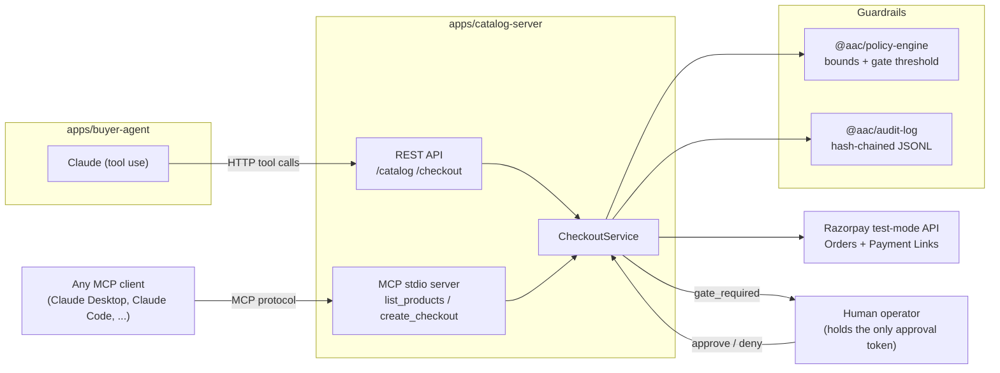

# AI Growth & Agentic Commerce

Make a merchant transactable by an AI buyer — end to end, on Razorpay test-mode APIs — with every
money action explainable, bounded, gated, and audited.

## Why now

NPCI's Unified Agentic Protocol (UAP) and the global protocol race (ACP, AP2, x402) are turning
agent-to-agent commerce into the open infrastructure problem of the year, and Razorpay's in-app
agent pilots are already live. Whoever defines how an AI buyer safely transacts with a merchant —
not just browses it — defines the next checkout layer.

This repo builds one direction all the way to a working system: **an agent-readable catalog that a
real AI buyer agent can browse and complete a purchase against**, using Razorpay's test-mode Orders
API for every transaction, with a policy engine, a human-approval gate, and a tamper-evident audit
log wrapped around every dollar (rupee) that moves.

## Architecture



Two independent surfaces expose the same merchant to two kinds of buyers:

- **REST API** (`/catalog`, `/checkout`) — what the demo `buyer-agent` talks to.
- **MCP server** (`apps/catalog-server/src/mcp.ts`) — a standards-based, agent-readable catalog any
  MCP client (Claude Desktop, Claude Code, another agent framework) can plug into directly. This is
  the literal answer to "agent-readable catalog": no custom SDK, just the Model Context Protocol.

Both surfaces share one `CheckoutService`, so bounds, gating, and the audit trail apply identically
no matter which protocol the buyer used.

## The bar, mapped to what's built

| Requirement | Where |
|---|---|
| **Explainable** | Every `checkout` response carries a `reasons[]` array. The policy engine never just says no — it says which bound was hit and by how much (`packages/policy-engine/src/index.ts`). |
| **Bounded** | Per-order cap, per-agent daily spend cap, and an allowed-category list, enforced before any Razorpay call is made (`config.policy` in `apps/catalog-server/src/config.ts`). |
| **Gated** | Orders at or above a threshold return `pending_approval` instead of capturing. Approval requires a token only the merchant operator holds — the buyer agent has no tool that can call `/checkout/:id/approve`, so it cannot approve its own spend (`apps/buyer-agent/src/operator.ts`). |
| **Audit trail** | Every decision (`checkout_requested`, `policy_evaluated`, `gate_required`, `gate_approved`, `order_created`, `payment_captured`/`payment_failed`, `checkout_declined`) is appended to a **hash-chained** JSONL log — tampering with any past entry breaks every hash after it. View it live at `/dashboard` (`packages/audit-log/src/index.ts`). |
| **One failure handled gracefully** | Out-of-stock at checkout time returns a clear decline *and* a same-category in-stock substitute, fully logged — not a crash, not a silent retry. A second, real failure path is also wired end to end: a genuine Razorpay API rejection (bad/expired test keys, network error) is caught, described in plain English, and logged as `payment_failed` rather than throwing. |

## What's real vs. simulated (read this before demoing)

- **Order creation is a real call** to Razorpay's test-mode Orders API on every checkout. Point
  this at your own test-mode keys and you'll see real orders appear in the Razorpay dashboard.
- **Card/UPI capture cannot legitimately happen server-to-server.** Razorpay requires client-side
  tokenization (Checkout.js or a hosted Payment Link) for PCI-DSS compliance — there is no honest
  "POST a card number" endpoint. So capture has two modes, both explicit about what they are:
  - `PAYMENT_MODE=simulated` (default) — for a fully unattended agent-to-agent demo, the payment is
    fabricated in the shape of a real Razorpay captured payment and clearly flagged `simulated: true`
    everywhere it's logged.
  - `PAYMENT_MODE=real_payment_link` — issues a real, payable Razorpay test-mode link. Pay it with a
    [published Razorpay test card](https://razorpay.com/docs/payments/payments/test-card-upi-details/)
    to see a genuine capture, at the cost of needing a human to click through.

This tradeoff is the same one every real agentic-commerce protocol (ACP, AP2, x402) is racing to
solve — how an AI buyer authorizes payment without becoming a PCI-scope card handler itself.

## Setup

```bash
npm install
cp .env.example .env
# fill in RAZORPAY_KEY_ID / RAZORPAY_KEY_SECRET (test mode, from
# https://dashboard.razorpay.com/app/keys) and ANTHROPIC_API_KEY
npm run build
```

## Run the demo

**Terminal 1 — the merchant:**

```bash
npm run dev:catalog
# → http://localhost:4000/catalog     agent-readable catalog
# → http://localhost:4000/dashboard   live audit trail
```

**Terminal 2 — the AI buyer:**

```bash
npm run dev:agent
# or give it its own goal:
npm run dev:agent -- "Buy a gift card and one accessory under ₹2000 total, explain your picks."
```

Watch terminal 2 narrate its reasoning and tool calls, watch terminal 1's `/dashboard` update live,
and watch the final `✅ audit log hash chain verified` line — that's the tamper-evidence check
running against the same log you just saw fill up.

To trigger the gate: ask for something over ₹3000 in one order (e.g. headphones + backpack). The
agent will hit `pending_approval`; with `AUTO_APPROVE=true` (default) a simulated operator approves
it after printing the gate details; set `AUTO_APPROVE=false` to approve/deny it yourself from the
buyer-agent's terminal.

To try the standards-based surface instead of the REST demo:

```bash
npm run --workspace=@aac/catalog-server mcp
```

and point any MCP client at that stdio process.

## Roadmap (not built yet)

The brief's other three directions are natural next phases on top of the same
`CheckoutService`/policy/audit core:

- **Upsell & cross-sell agent** — the catalog already carries `upsellWith` pairings per product;
  wiring a proactive suggestion pass onto `create_checkout` is the next step.
- **Conversational in-app checkout** — swap the CLI buyer-agent's I/O for a chat UI; the tool-use
  loop underneath doesn't change.
- **Campaign orchestrator** — a scheduled agent that proposes bounded, gated discount campaigns
  across the catalog, reusing the same policy-engine bounds at a campaign level instead of a
  per-order level.

## Repo layout

```
packages/audit-log        hash-chained, append-only audit trail
packages/policy-engine    bounds (max order, daily cap, categories) + human-approval gate
packages/razorpay-client  thin Razorpay test-mode wrapper (orders, payment links, error parsing)
apps/catalog-server       REST API + MCP server + the merchant's CheckoutService
apps/buyer-agent          Claude-powered AI buyer (tool use) + simulated human-operator gate
```
